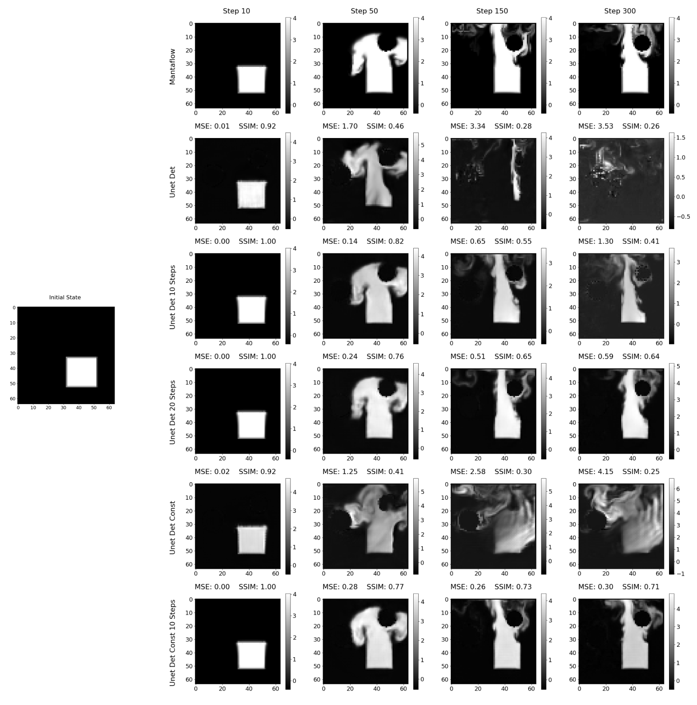

# Approximating Fluid Simulations with UNets

Over the past few years, the accuracy of computer generated fluid simulations has increased significantly. However, these simulations only approximate the numerical solution of the complex differential equations describing fluid flow to a certain extent. In fact, increasing the approximation's accuracy necessitates a significant amount of computational effort. Recent studies have successfully reduced this effort while maintaining a high level of accuracy by utilizing deep learning models. This study aims to determine the extent at which a simple [UNet](https://arxiv.org/abs/1505.04597) with the mean-squared error loss function can learn to approximate fluid simulations with a single smoke source. The model's capacity to learn from simulations is shown to increase when the source emits a constant volume of smoke over its area and the distance between learned steps is increased from one to ten. As a result, the predicted simulations often exhibit a higher degree of similarity to the target simulations while maintaining a relative error on the frequency power comparable to introducing a medium amount of perturbance. Tests on the power spectrum development of the different predictions were successful in identifying a power-law relationship between frequency and power in log-log space. Finally, the study presents a method for quickly approximating fluid simulations within a known error bound using a simple [UNet](https://arxiv.org/abs/1505.04597).

<figure>

<figcaption align = "center"><b>Comparison of the density channel between <a href="http://mantaflow.com">Mantaflow</a> and the various models trained on the deterministic dataset.</b></figcaption>
</figure>

------

This repository contains additional results, as well as the source code used throughout my thesis. It is structured as follows:

- Code 
    
    _Contains the source code used for training the model, as well as creating the evaluations. Additionally, the most relevant Mantaflow scripts used to generate the data are included._
    - Evaluations
    - Mantaflow
    - Model
- Fourier Analysis
   
    _Contains the results of the Fourier Analysis concluded on each signal, residual and relative error._
    - UNet
        - SIGNAL 
            - 2D
            - 3D
            - CIRCLE
            - LOGLOG
        - ...
    - UNet Deterministic
        - ...
- Visual Results

    _Contains the visual representation of each prediction made. The development of the individual channels is compared to the development of the target simulations for each UNet version used throughout the research. In addition to the comparison at selected steps, each prediction file includes GIFs of the original and predicted density development._
    - UNet
        - sim_000000/STEPS
        _ ...
    - UNet Deterministic
        _ ...
    - ...

Please feel free to contact me under <a href="mailto:snistor@students.uni-mainz.de">snistor@students.uni-mainz.de</a> if you need any further information. 
